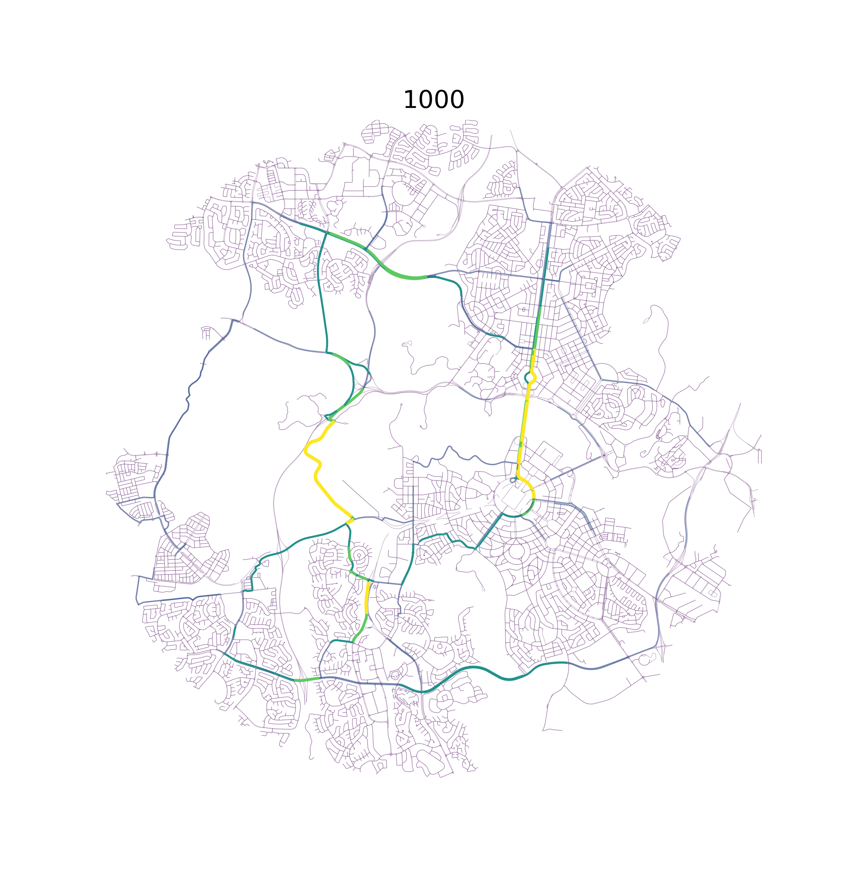
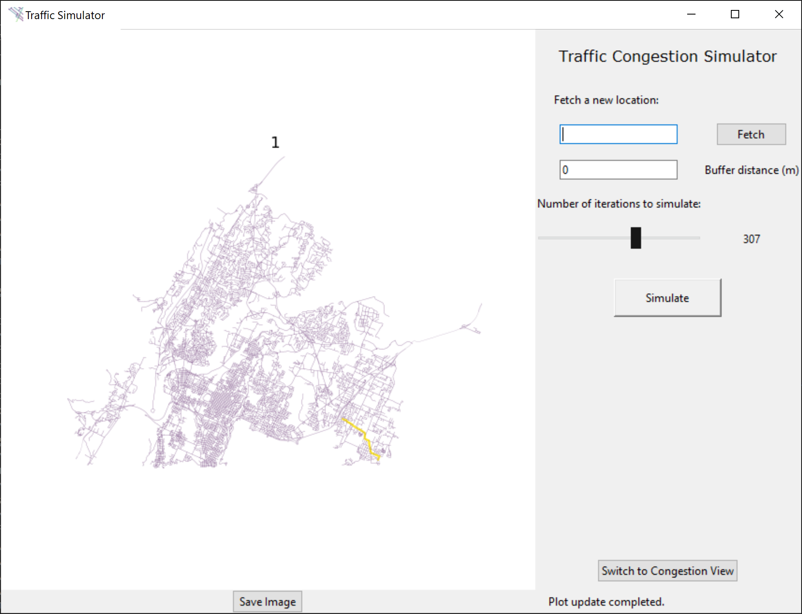

# Traffic Simulator for Python 3.7+

This program is a traffic simulator I developed to highlight stressed areas in road networks and potential locations to focus on as a planner. It utilizes A* Search to pathfind multiple AI cars, and cumulatively modifies a road network to find natural locations where vehicles concentrate. It pulls data from OpenStreetMap through OSMNX and plots real-world road networks.

This program comes with a TKinter UI to allow for easier use of the program, without having to do everything through command line. The program still needs to be initialized through command line. It requires OSMNX and all of its dependencies. To install OSMNX go to the OSMNX github page. I recommend using the conda method to install it. To run from there run traffic.py.

When saving an image, it will save to the main directory as result.png. Beware, with large maps this image can probably run up on hundreds of megabytes. For a reasonable sized city like Atlanta (represent) it results in a sharp but not unreasonably large image.

If I were to spend more time on this I would probably:
* Iron out more efficient ways of all pathfinding oriented things. At the moment there are some repeated steps
* Implement multithreading, for very large road networks it gets slow
* Find a more accurate sampling method for the starting and end points of the AI "cars", including a more accurate measurement of population density or zoning.
* If I REALLY wanted to sink time into this I would do some sort of real time simulation, but that's a little much